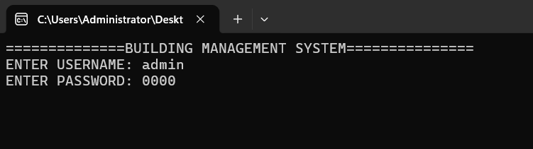
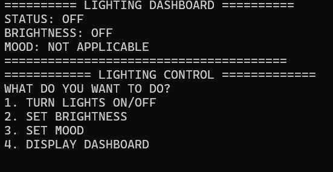
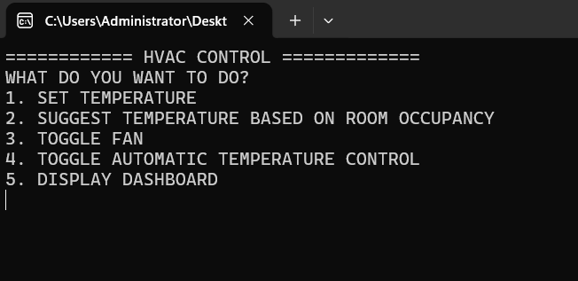
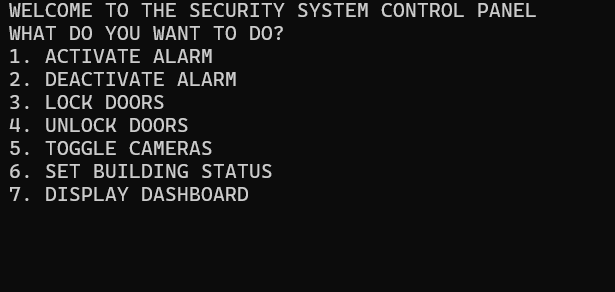
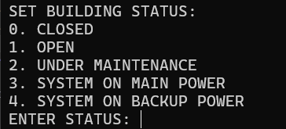
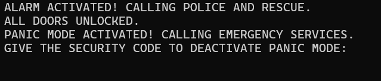

# Smart Building Management System

Smart Building Management System automates and centrally controls building subsystems like **lighting, HVAC, and security**, ensuring **efficiency, security, and energy savings**. This project demonstrates how **C++ and Object-Oriented Programming (OOP)** can be applied to real-world building management solutions.

## Features
- Centralized control of lighting, HVAC, and security
- User authentication for secure access
- Modular design with independent subsystems
- Energy-efficient operations
- Easy-to-use console dashboard

## Technologies Used
- **C++** for implementation
- **Object-Oriented Programming (OOP)** for modular design
- Console-based interface for user interaction

## How It Works
- Each subsystem (Lighting, HVAC, Security) operates as an **independent module**.
- Modules communicate with a **central dashboard** for coordinated control.
- System behavior is managed through **defined states and logical conditions**.
- **User authentication** ensures only authorized access.
- Users navigate through **Login → Main Menu → Subsystems → User Show screens**.

## Screenshots
### Login Screen


### Main Menu


### User Show Screen


### Lighting Control


### HVAC Module


### Security Module


### Building status Module


### PANIC MODE Module



## Installation / Usage
1. Clone the repository:
   ```bash
   git clone https://github.com/Ghunain43/Smart-Building-Management-System.git

2. Open the project in your preferred C++ IDE.

3. Compile and run main.cpp.

4. Follow on-screen instructions to interact with the dashboard.


## Author
Ghunain43

Email: ghunain.fayaz@gmail.com

GitHub: https://github.com/Ghunain43

